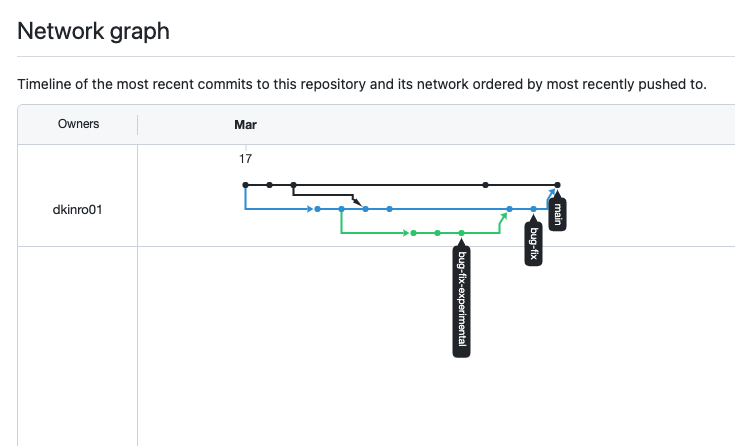

# git_branching

## Visualization of 15 commits:
https://github.com/dkinro01/git_branching/network
 

 
## Terminal commands to get the network graph above:
01 git init 
02 git add README.md 
03 git commit -m "Initial commit" 
04 git checkout -b bug-fix 
05 git checkout main 
06 git commit -a -m "1" 
07 git commit -a -m "2" 
08 git checkout bug-fix 
09 git commit -a -m "3" 
10 git commit -a -m "4" 
11 git checkout -b bug-fix-experimental 
12 git checkout bug-fix 
13 git merge main 
14 git mergetool 
15 git commit -a -m "Merge branch 'main' into bug-fix" 
16 git checkout bug-fix 
17 git commit -a -m "6" 
18 git checkout bug-fix-experimental 
19 git commit -a -m "7" 
20 git commit -a -m "8" 
21 git commit -a -m "9" 
22 git checkout main 
23 git commit -a -m "10" 
24 git checkout bug-fix 
25 git merge bug-fix-experimental 
26 git mergetool 
27 git commit -a -m "Merge branch 'bug-fix-experimental' into bug-fix" 
28 git checkout bug-fix 
29 git commit -a -m "12” 
30 git checkout main 
31 git merge bug-fix 
32 git mergetool 
33 git commit -a -m "Merge branch 'bug-fix'" 
## Note to marker:
In a few practice runs, I was getting merges wrong when I used numbers, so I have expressly written out what I wanted to do instead of using numbers for commits 5, 11, and 13.
